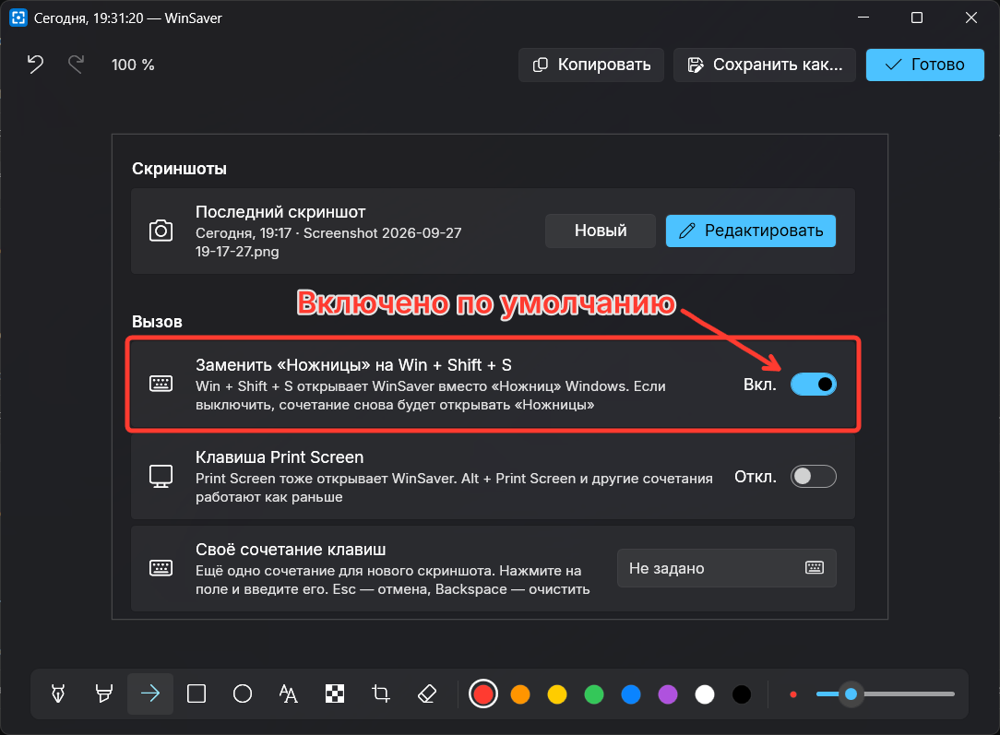
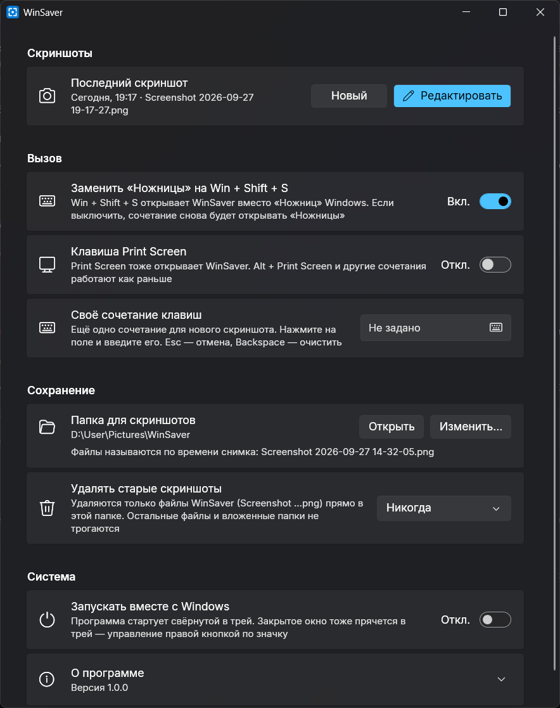

# WinSaver

Маленький скриншотер для Windows 11 вместо «Ножниц». Нажимаете **Win + Shift + S**, выбираете область — и картинка уже в буфере обмена и в папке. Никаких уведомлений после снимка: если скриншот нужно подправить, откройте его из трея.



## Что умеет

- **Win + Shift + S** открывает WinSaver вместо «Ножниц». Тумблер в настройках возвращает сочетание Windows
- Выбор области как в Windows: прямоугольник, окно или весь экран. Экран замирает на время выбора, выделение можно тянуть через несколько мониторов с разным масштабом
- Скриншот сразу попадает в буфер обмена и сохраняется в `Изображения\WinSaver` или в выбранную папку
- Файлы называются по времени снимка: `Screenshot 2026-09-27 14-32-05.png`
- Автоочистка: старые скриншоты удаляются через день, неделю, месяц — или никогда
- Трей: щелчок по значку открывает последний скриншот в редакторе, в меню — недавние с миниатюрами и временем
- Редактор в духе Telegram: перо, маркер, стрелка (рисуете линию — наконечник появляется сам), прямоугольник, овал, текст, размытие, обрезка и ластик. Отмена и повтор, масштаб колесом
- Клавиша Print Screen и своё сочетание клавиш — по желанию
- Портативная: один exe, устанавливать ничего не нужно, настройки хранятся рядом с ним
- Запуск вместе с Windows, проверка обновлений, настройки в стиле Windows 11 со светлой и тёмной темой



## Как запустить

Скачайте `WinSaver-…-win-x64.exe` со страницы [релизов](https://github.com/Frezesov/WinSaver/releases) и запустите. .NET уже внутри exe, ставить ничего не нужно.

Собрать самому (нужен .NET SDK 10):

```
dotnet publish -c Release -o dist
```

Запустите `dist\WinSaver.exe`. Чтобы открыть настройки, щёлкните по значку в трее правой кнопкой → «Настройки…» или запустите программу ещё раз.

## Как отредактировать скриншот

- Левый щелчок по значку в трее — последний скриншот сразу открывается в редакторе
- Правый щелчок → «Недавние» — любой из последних десяти, с миниатюрой и временем снимка
- В настройках есть кнопка «Редактировать» рядом с последним скриншотом

В редакторе «Готово» (Ctrl + S) перезаписывает файл скриншота и копирует результат в буфер обмена, «Копировать» (Ctrl + C) только копирует, «Сохранить как…» пишет отдельный PNG или JPEG.

Горячие клавиши инструментов: P — перо, M — маркер, A — стрелка, R — прямоугольник, O — овал, T — текст, B — размытие, C — обрезка, E — ластик. С Shift линии получаются прямыми, прямоугольник — квадратом, овал — кругом. Ctrl + колесо — масштаб, Ctrl + 0 — вписать в окно, пробел или средняя кнопка мыши — двигать картинку.

## Полезно знать

- Win + Shift + S перехватывается, только пока WinSaver запущен. Закрыли программу — сочетание снова открывает «Ножницы». В реестре ничего не меняется.
- Когда активно окно программы, запущенной от имени администратора, Windows не даёт обычным программам перехватывать клавиши, и в нём Win + Shift + S откроет «Ножницы».
- Автоочистка удаляет только файлы с именами WinSaver (`Screenshot …png`) прямо в выбранной папке. Другие файлы и вложенные папки она не трогает, так что сохранять скриншоты можно куда угодно.
- Снимки хранятся в PNG без потерь, с тем же разрешением, что на экране.
- Настройки лежат в `settings.json` рядом с программой, а если туда нельзя писать — в `%APPDATA%\WinSaver`. Там же `error.log`, если что-то пошло не так.
- При первом запуске exe распаковывает встроенный .NET во временную папку `%TEMP%\.net\WinSaver` (около 160 МБ). Так программа стартует быстро и занимает меньше памяти. Папку можно удалить — при следующем запуске она появится снова.
- Раз в сутки программа спрашивает у GitHub, вышла ли новая версия, и показывает ссылку на неё. Сама она ничего не скачивает; проверку можно выключить в блоке «О программе».
- Программа не подписана, поэтому при первом запуске Windows может показать предупреждение SmartScreen: «Подробнее» → «Выполнить в любом случае».

## Спасибо

Шрифт Inter распространяется по лицензии SIL OFL 1.1. Подробнее в [THIRD-PARTY-NOTICES.txt](THIRD-PARTY-NOTICES.txt).
